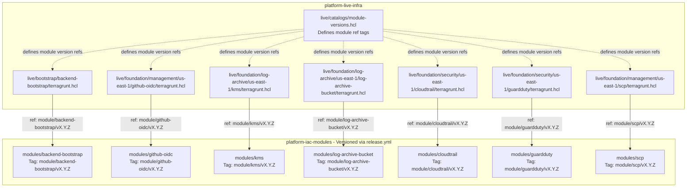

# Platform IaC Modules

[](https://github.com/Mahdiar-Farzinfar/platform-iac-modules/actions/workflows/validate.yml)
[](https://github.com/Mahdiar-Farzinfar/platform-iac-modules/actions/workflows/security-scan.yml)
[](https://github.com/Mahdiar-Farzinfar/platform-iac-modules/actions/workflows/cross-platform-test.yml)
[](https://github.com/Mahdiar-Farzinfar/platform-iac-modules/releases/latest)
[](https://github.com/Mahdiar-Farzinfar/platform-iac-modules/actions/workflows/devcontainer-image.yml)
[](./SECURITY.md)
[](LICENSE)
[](./CODE_OF_CONDUCT.md)
[](https://developer.hashicorp.com/terraform)
[](./.github/renovate.json)
[](https://scorecard.dev/viewer/?uri=github.com/Mahdiar-Farzinfar/platform-iac-modules)

> **Architecture Note:** This repository provides **stateless, reusable Terraform modules**. Do **not** run `terraform apply` directly from this repository. Environment composition, backend/state management, provider configuration, and deployment orchestration belong in a separate live infrastructure repository such as `platform-live-infra`.

Enterprise-grade Terraform modules for building and operating a secure AWS platform foundation.

This repository contains reusable, versioned, and security-focused Infrastructure as Code (IaC) modules designed to support a multi-account AWS landing zone and platform baseline. The modules are intended to be consumed by a separate live infrastructure repository via Terragrunt.

## Table of Contents

- [Objectives](#objectives)
- [Platform Assumptions](#platform-assumptions)
- [Module Catalog](#module-catalog)
- [Design Principles](#design-principles)
- [Repository Structure](#repository-structure)
- [What “Production-Ready” Means Here](#what-production-ready-means-here)
- [Quick Start](#quick-start)
- [Usage Model](#usage-model)
- [Local Development Workflow](#local-development-workflow)
- [Definition of Done](#definition-of-done)
- [Validation and Quality Gates](#validation-and-quality-gates)
- [Testing Strategy](#testing-strategy)
- [Documentation Standards](#documentation-standards)
- [Versioning and Releases](#versioning-and-releases)
- [Deprecation Policy](#deprecation-policy)
- [Security Posture](#security-posture)
- [Contribution Model](#contribution-model)
- [Module Authoring Conventions](#module-authoring-conventions)
- [Relationship to Live Infrastructure](#relationship-to-live-infrastructure)
- [Consumer Responsibilities](#consumer-responsibilities)
- [Governance Notes](#governance-notes)
- [Roadmap Ideas](#roadmap-ideas)
- [License](#license)
- [Support](#support)

## Objectives

- Provide composable Terraform modules with clear interfaces and predictable behavior
- Standardize platform security, governance, logging, and identity controls
- Enable safe reuse across environments, accounts, and regions
- Enforce consistent validation, testing, documentation, and release practices
- Keep the module portfolio maintainable, auditable, and automation-friendly

## Platform Assumptions

These modules are designed for AWS platform foundations with explicit account, region, and governance boundaries.

- The target platform is expected to use a multi-account AWS model.
- Organization-level modules assume AWS Organizations is already available and appropriately governed.
- Security services may require delegated administrator configuration outside the module boundary.
- Region enablement, region restrictions, and rollout strategy are owned by the live infrastructure repository.
- Account vending, workload onboarding, and environment orchestration are intentionally out of scope for this repository.
- Callers are responsible for providing the correct provider configuration, permissions, account targeting, and backend configuration.

Each module README should document any additional account-level, organization-level, or service-level prerequisites.

## Module Catalog

The current module portfolio includes:

| Module | Purpose |
| --- | --- |
| [`backend-bootstrap`](modules/backend-bootstrap/README.md) | Bootstraps Terraform remote state prerequisites such as state storage and locking dependencies |
| [`github-oidc`](modules/github-oidc/README.md) | Configures AWS IAM trust for GitHub Actions via OpenID Connect |
| [`kms`](modules/kms/README.md) | Provisions KMS keys and related configuration for encryption use cases |
| [`log-archive-bucket`](modules/log-archive-bucket/README.md) | Creates and manages centralized log archive S3 buckets |
| [`cloudtrail`](modules/cloudtrail/README.md) | Enables and configures AWS CloudTrail for audit logging |
| [`guardduty`](modules/guardduty/README.md) | Enables and configures Amazon GuardDuty for threat detection |
| [`scp`](modules/scp/README.md) | Manages AWS Organizations Service Control Policies |

The authoritative module inventory is maintained in [`catalog/modules.yaml`](catalog/modules.yaml). This catalog should be treated as the source of truth for module ownership, lifecycle status, maturity, release metadata, and automation-facing module metadata.

## Design Principles

This repository follows a few non-negotiable engineering principles:

- `Single responsibility`: each module should solve one well-defined problem
- `Secure by default`: defaults should favor least privilege, encryption, and auditability
- `Composable`: modules should work well together without creating hidden coupling
- `Explicit interfaces`: inputs, outputs, assumptions, and constraints must be documented
- `Stable upgrades`: changes must be versioned and released with clear compatibility expectations
- `Cross-platform contributor experience`: local automation and validation workflows should remain usable across Linux, macOS, and Windows where practical
- `Automation-first`: formatting, validation, documentation, and checks should be CI-friendly

## Repository Structure

```text
platform-iac-modules/
├── README.md
├── SECURITY.md
├── CONTRIBUTING.md
├── CODE_OF_CONDUCT.md
├── CHANGELOG.md
├── CODEOWNERS
├── LICENSE
├── go.mod                   # Go dependencies for CI utilities and integration tests
├── .gitignore
├── .gitattributes
├── .editorconfig
├── .pre-commit-config.yaml
├── .terraform-docs.yml
├── Taskfile.yml             # Canonical local automation entry point
├── justfile                 # Thin wrapper around Task targets for Just users
├── Makefile                 # Thin wrapper around Task targets for Make users
├── .devcontainer/           # Development Container configuration
├── .vscode/                 # Recommended Visual Studio Code settings
├── .github/                 # Repository automation and CI workflows
├── docs/                    # Documentation site source and content
├── scripts/                 # Bootstrap, CI, and tool-management utilities
├── tooling/                 # Shared tool and validation configuration
├── modules/                 # Reusable Terraform modules
│   ├── README.md            # Module portfolio overview
│   ├── backend-bootstrap/
│   ├── github-oidc/
│   ├── kms/
│   ├── log-archive-bucket/
│   ├── cloudtrail/
│   ├── guardduty/
│   └── scp/
├── tests/                   # Cross-module and cross-platform test suites
└── catalog/                 # Module inventory and metadata
    └── modules.yaml
```

### Key Directories

| Path | Purpose |
| --- | --- |
| `.github/` | Pull request templates, dependency automation, and CI workflows |
| `.devcontainer/` | Reproducible containerized development environment |
| `.vscode/` | Recommended editor settings and extensions |
| `docs/` | Source content for the project documentation site, including architecture, security, versioning, and contributor guides |
| `scripts/` | Environment bootstrap, CI support, and tool-management utilities |
| `tooling/` | Shared Terraform, security, and cross-platform tool configuration |
| `modules/` | Independently versioned and reusable Terraform modules |
| `tests/` | Repository-level smoke and operating-system validation tests |
| `catalog/` | Machine-readable module inventory and metadata |

### Terraform Module Layout

Each Terraform module follows a consistent structure:

```text
modules/<module-name>/
├── README.md                # Module usage and generated API documentation
├── main.tf                  # Primary resources and module logic
├── variables.tf             # Input variable declarations
├── outputs.tf               # Output value declarations
├── versions.tf              # Terraform and provider requirements
├── locals.tf                # Internal expressions and derived values
├── tests/
│   ├── tftest.hcl           # Native Terraform tests
│   └── integration-test.go  # Optional Go-based integration tests
└── examples/
    └── basic/
        └── main.tf          # Minimal working example
```

The `integration-test.go` file is included only for modules that require infrastructure-level integration testing. Module-specific usage, requirements, inputs, outputs, examples, and operational considerations are documented in each module's `README.md`.

## What “Production-Ready” Means Here

A module is considered production-ready when it meets all of the following expectations:

- Has a narrowly scoped and clearly documented purpose
- Includes `main.tf`, `variables.tf`, `outputs.tf`, and `versions.tf`
- Uses sensible defaults and avoids unsafe implicit behavior
- Includes usage examples under `examples/`
- Includes validation and test coverage appropriate to its risk level
- Has generated or maintained documentation in its local `README.md`
- Passes formatting, validation, linting, and security checks in CI
- Is released with changelog visibility and semantic versioning discipline

## Quick Start

> [!IMPORTANT]
> This repository contains reusable Terraform modules, not deployable environment
> configurations. Do not run `terraform apply` from the repository root. See
> [Usage Model](#usage-model) for supported module consumption patterns.

### 1. Clone and bootstrap the repository

```bash
git clone https://github.com/Mahdiar-Farzinfar/platform-iac-modules.git
cd platform-iac-modules
```

Install the required tooling using the bootstrap script appropriate for your operating system:

```bash
# Linux or macOS
./scripts/bootstrap/setup.sh

# Windows PowerShell
./scripts/bootstrap/setup.ps1
```

Alternatively, use the prebuilt development container image:

```bash
docker pull ghcr.io/mahdiar-farzinfar/platform-iac-modules/devcontainer:latest
```

Verify the local toolchain and install the Git hooks:

```bash
python scripts/tools/verify-toolchain.py
pre-commit install
```

### 2. Discover the available modules and tasks

```bash
task --list
```

Review the module catalog and the selected module's documentation before use:

```text
catalog/modules.yaml
modules/<module-name>/README.md
modules/<module-name>/examples/basic/
```

### 3. Validate the repository locally

Run the canonical local validation workflow before submitting changes:

```bash
task ci
```

See [Validation and Quality Gates](#validation-and-quality-gates) for the full quality workflow, including formatting, tests, documentation generation, security scanning, and pre-commit checks.

## Usage Model

These modules are reusable building blocks for Terraform-based infrastructure. They
are intended to be consumed from a separate live infrastructure repository that
defines deployable environment and account-specific stacks.

This repository does not define complete environments and must not be used as the
deployment root. Do not run `terraform apply` or `terragrunt apply` from the
repository root. Deployment orchestration must be performed from the live
infrastructure repository with explicit backend, provider, account, region, and
approval configuration.

Typical consumption patterns include:

- Terraform root modules referencing released module versions by immutable Git tags
- Terragrunt configurations sourcing released module versions
- Central platform repositories enforcing approved module versions and upgrade policies

### Terraform Consumption

A Terraform root module in the live infrastructure repository can reference a
module using a module-scoped release tag:

```hcl
module "cloudtrail" {
  source = "git::https://github.com/Mahdiar-Farzinfar/platform-iac-modules.git//modules/cloudtrail?ref=cloudtrail/v1.2.0"

  name_prefix                = "platform"
  enable_log_file_validation = true

  tags = {
    ManagedBy = "Terraform"
    Owner     = "platform"
  }
}
```

The Terraform root module is responsible for configuring the required providers,
backend, variables, environment-specific values, and any provider aliases required
by the module:

```hcl
terraform {
  required_version = ">= 1.6.0"

  required_providers {
    aws = {
      source  = "hashicorp/aws"
      version = ">= 5.0.0, < 6.0.0"
    }
  }

  backend "s3" {
    # Backend configuration belongs to the live infrastructure repository.
  }
}

provider "aws" {
  region = var.aws_region
}
```

### Terragrunt Consumption

A Terragrunt configuration in the live infrastructure repository can source the
same released module version:

```hcl
terraform {
  source = "git::https://github.com/Mahdiar-Farzinfar/platform-iac-modules.git//modules/cloudtrail?ref=cloudtrail/v1.2.0"
}

include "root" {
  path = find_in_parent_folders("terragrunt.hcl")
}

inputs = {
  name_prefix                = "platform"
  enable_log_file_validation = true

  tags = {
    ManagedBy = "Terragrunt"
    Owner     = "platform"
  }
}
```

The parent Terragrunt configuration is responsible for shared backend and provider
configuration, account and region targeting, remote state conventions, common
inputs, and environment-specific orchestration:

```hcl
# live-infrastructure/terragrunt.hcl

remote_state {
  backend = "s3"

  config = {
    bucket = "platform-terraform-state"
    key    = "${path_relative_to_include()}/terraform.tfstate"
    region = "eu-west-1"
  }
}

generate "provider" {
  path      = "provider.tf"
  if_exists = "overwrite_terragrunt"

  contents = <<EOF
provider "aws" {
  region = "eu-west-1"
}
EOF
}
```

### Consumption Requirements

Before planning or applying a module from the live infrastructure repository:

1. Pin an immutable module-scoped release tag rather than a branch or mutable
   reference.
2. Review the selected module's README, inputs, outputs, prerequisites, and
   changelog.
3. Configure the backend, provider aliases, assume-role behavior, account, and
   region in the live infrastructure repository.
4. Verify that the selected module version is approved for the target environment.
5. Run `terraform init` or `terragrunt init`.
6. Run `terraform plan` or `terragrunt plan` and review the generated plan through
   the approved workflow.
7. Run `terraform apply` or `terragrunt apply` only from the live infrastructure
   repository after the required approval.

Live infrastructure repositories own environment composition, account targeting,
provider and backend configuration, dependency ordering, rollout orchestration,
approval workflows, and runtime operations. This module repository owns reusable
module implementation, module documentation, compatibility constraints, examples,
validation, and released module versions.

## Local Development Workflow

A recommended contributor workflow is:

1. Create or update a module under `modules/<module-name>/`
2. Implement logic in `main.tf`, `variables.tf`, `outputs.tf`, and supporting files
3. Add or update examples under `examples/basic/`
4. Add or update tests under `tests/`
5. Generate or refresh documentation
6. Run formatting, validation, linting, and security checks
7. Open a pull request with clear scope and release impact

## Definition of Done

A module change is considered ready for review when the following conditions are met:

- Terraform formatting has been applied with `terraform fmt`.
- Terraform validation passes for the affected module and examples.
- TFLint checks pass using the repository configuration.
- Module documentation has been refreshed with `terraform-docs`.
- Security scans pass with the configured Checkov and Trivy policies, or exceptions are explicitly justified.
- Relevant unit, smoke, or integration tests have been added or updated.
- `catalog/modules.yaml` reflects any module metadata, ownership, maturity, or lifecycle changes.
- `CHANGELOG.md` documents user-visible changes, breaking changes, migrations, and release impact.

## Validation and Quality Gates

This repository is intended to enforce quality through layered checks:

### Formatting and validation

Use the repository task runners and helper tooling where applicable:

```bash
task --list
just --list
make help
```

`Taskfile.yml` is the canonical automation definition in this repository. `justfile` and `Makefile` are thin convenience wrappers for contributors who prefer those interfaces.

### Documentation generation

```bash
task docs
just docs
make docs
```

### Security scanning

```bash
task security:all
just security-all
make security-all
```

### Pre-commit checks

```bash
pre-commit run --all-files
```

CI workflows under `.github/workflows/` should validate formatting, module correctness, documentation integrity, and security posture before merge.

## Testing Strategy

Testing should be pragmatic and proportional to module criticality.

### Expected layers

- `Static validation`: `terraform validate`, linting, and policy/security scanning
- `Module contract tests`: verify input/output behavior and expected resource graph
- `Example validation`: ensure examples remain usable and current
- `Integration tests`: used for higher-risk modules such as security, audit, or encryption controls
- `Smoke tests`: cross-module sanity checks where needed
- `Cross-platform checks`: validate contributor and automation workflows across supported operating systems

### Test locations

- Module-local tests: `modules/<module>/tests/`
- Cross-module smoke tests: `tests/smoke/`
- Cross-platform checks: `tests/cross-platform/`

Modules such as `kms`, `cloudtrail`, `guardduty`, and `scp` should generally receive stronger test coverage because they impact foundational security and governance controls.

## Documentation Standards

Every module should include a `README.md` that documents at minimum:

- Purpose and use cases
- Inputs and outputs
- Example usage
- Dependencies and assumptions
- Security considerations
- Known limitations
- Upgrade or migration notes when relevant

Repository-wide guidance is available in:

- `docs/module-development.md`
- `docs/security-baseline.md`
- `docs/versioning.md`
- `docs/cross-platform.md`

## Versioning and Releases

This repository uses automated, domain-scoped releases from the `main` branch.
The release workflow discovers changed areas of the repository, calculates the
next Semantic Versioning increment from Conventional Commit messages, creates
immutable annotated tags, and publishes GitHub Releases where applicable.

Releases are managed by the `.github/workflows/release.yml` workflow and may run
on pushes to `main` or through manual `workflow_dispatch`.

### Release Domains

Because this repository contains multiple independently evolving artifacts,
versions are scoped by release domain rather than by a single repository-wide version.

The supported release domains are:

| Domain type | Scope | Tag format | GitHub Release |
| --- | --- | --- | --- |
| Terraform module | `modules/<module-name>/` | `module/<module-name>/v<MAJOR>.<MINOR>.<PATCH>` | Yes |
| Repository/root metadata | repository-level files | `root/v<MAJOR>.<MINOR>.<PATCH>` | Yes |
| Development container image | `.devcontainer/`, `docker-compose.dev.yml` | `image/devcontainer/v<MAJOR>.<MINOR>.<PATCH>` | No |

Examples:

```text
module/cloudtrail/v1.2.0
root/v0.4.0
image/devcontainer/v0.3.1
```

Terraform module consumers should reference module-scoped tags explicitly:

```hcl
source = "git::https://github.com/Mahdiar-Farzinfar/platform-iac-modules.git//modules/cloudtrail?ref=module/cloudtrail/v1.2.0"
```

Do not rely on repository-wide tags for Terraform module consumption. Each module
is versioned independently through its own module release domain.

### Change Detection

The release workflow determines release domains from the changed files in the current commit range.

Changes under:

```text
modules/<module-name>/
```

trigger a release candidate for:

```text
module/<module-name>
```

Changes under:

```text
.devcontainer/
```

trigger a release candidate for:

```text
image/devcontainer
```

Repository-level files such as workflow definitions, documentation, tooling,
catalog files, tests, and top-level project metadata trigger a release candidate
for:

```text
root
```

If no supported release domain has changed, the workflow exits without creating a release.

### Version Calculation

Each release domain is versioned independently using Semantic Versioning:

```text
<MAJOR>.<MINOR>.<PATCH>
```

The workflow finds the latest existing tag for the affected domain and calculates
the next version from commit messages in the relevant path.

Version bumps are derived from Conventional Commit-style messages:

| Commit signal | Version bump | Example |
| --- | --- | --- |
| Breaking change footer | `MAJOR` | `BREAKING CHANGE: remove deprecated variable` |
| Breaking change marker | `MAJOR` | `feat(module)!: change input contract` |
| Feature | `MINOR` | `feat: add lifecycle rule support` |
| Fix/performance/refactor/revert/security | `PATCH` | `fix: correct bucket policy condition` |

Supported patch-level commit types include:

```text
fix
perf
refactor
revert
security
```

If the workflow cannot detect a release-worthy commit message for a changed
domain, that domain is skipped.

For a domain with no previous tag, the workflow starts from `0.0.0` and applies
the detected bump. For example, the first `feat:` release becomes `0.1.0`, and
the first `fix:` release becomes `0.0.1`.

### Release Artifacts

For non-image release domains, the workflow creates:

- an immutable annotated Git tag
- a GitHub Release
- generated release notes based on commits since the previous domain tag
- a follow-up pull request updating `CHANGELOG.md`

For the development container image domain, the workflow creates the version tag but does not publish a GitHub Release entry.

### Changelog Management

`CHANGELOG.md` is updated automatically after successful non-image releases.

The workflow does not commit changelog updates directly to `main`. Instead, it opens a pull request from an automation branch:

```text
automation/changelog-<workflow-run-id>
```

This keeps changelog updates reviewable and preserves the normal pull request flow for documentation changes.

### Release Discipline

Contributors should follow these rules to keep automated releases predictable:

- Use Conventional Commit messages for all user-facing changes.
- Use `feat:` for backward-compatible new functionality.
- Use `fix:`, `perf:`, `refactor:`, `revert:`, or `security:` for patch-level
  changes.
- Use `!` or a `BREAKING CHANGE:` footer for breaking module interface or
  behavior changes.
- Keep breaking changes explicit and documented for downstream live
  infrastructure repositories.
- Treat published version tags as immutable.
- Reference Terraform modules by their module-scoped tags.
- Keep `catalog/modules.yaml` aligned with the latest intended module versions
  and metadata.

## Deprecation Policy

Deprecations should be explicit, documented, and safe for downstream consumers.

- Deprecated inputs, outputs, resources, or modules must be called out in the module README and changelog.
- Whenever possible, deprecated interfaces should remain available for at least one minor release before removal.
- Removal of a deprecated interface requires a major version bump for the affected module.
- Migration guidance should be provided for any breaking change, including replacement inputs, changed defaults, or required state moves.
- Deprecated behavior should not silently change security posture or resource ownership.
- Module-scoped tags should clearly identify the first version containing the deprecation and the version where removal occurs.

Consumers should pin module versions and review changelog entries before upgrading across minor or major versions.

## Security Posture

Security is a first-class concern for this repository.
Modules must never contain real secrets, credentials, tokens, private keys, or hardcoded sensitive values. Any sensitive input must be explicitly marked, documented, and handled in a way that avoids accidental exposure through outputs, logs, state, examples, or generated documentation.

### Minimum expectations

- Prefer least-privilege IAM design
- Enable encryption at rest where applicable
- Preserve auditability and log integrity
- Avoid unsafe defaults
- Document sensitive inputs clearly
- Scan code and dependencies in CI

Refer to:

- `SECURITY.md`
- `docs/security-baseline.md`
- `tooling/.checkov.yml`
- `tooling/.trivyignore`

If you discover a potential vulnerability, do not open a public issue. Follow the disclosure guidance in `SECURITY.md`.

## Contribution Model

Even in a solo-maintained repository, contribution standards should remain high to preserve long-term maintainability.

Please review:

- `CONTRIBUTING.md`
- `.github/PULL_REQUEST_TEMPLATE.md`

Recommended practices:

- Keep pull requests focused and small
- Separate refactors from behavior changes where possible
- Update tests and docs alongside code changes
- Treat examples as part of the public contract

## Module Authoring Conventions

Modules in this repository should generally follow these conventions:

- Keep provider requirements in `versions.tf`
- Use `locals.tf` for derived values, naming, tagging, and repeated expressions
- Keep variable definitions typed and validated
- Expose only meaningful outputs
- Avoid hardcoding environment-specific values
- Avoid embedding deployment orchestration concerns inside reusable modules

### Adding a New Module Checklist

When adding a new module, complete the following before opening a pull request:

- [ ] Create the module under `modules/<name>/` with `main.tf`, `variables.tf`, `outputs.tf`, `versions.tf`, `locals.tf`, and `README.md`
- [ ] Add a runnable basic example under `modules/<name>/examples/basic/main.tf`
- [ ] Add static Terraform tests under `modules/<name>/tests/tftest.hcl`
- [ ] Add integration tests under `modules/<name>/tests/integration-test.go` when the module is security-sensitive, stateful, organization-scoped, or otherwise high risk
- [ ] Update `catalog/modules.yaml` with the module entry and release metadata
- [ ] Generate module documentation with the repository task runner, such as task docs
- [ ] Run formatting, validation, linting, tests, and security scans before merge
- [ ] Tag the initial release using `<module-name>/v0.1.0` after merge

## Relationship to Live Infrastructure

This repository is typically paired with a separate live infrastructure repository that:

- Defines environments, accounts, and regions
- Composes these modules into deployable stacks
- Pins approved module versions
- Manages plan/apply workflows and drift detection
- Handles runtime operations and change rollout sequencing

A clean separation between reusable modules and live environment configuration is strongly recommended for auditability, safe promotion, and platform scalability.

### Architecture Flow



## Consumer Responsibilities

Consumers of these modules are responsible for operational composition and runtime safety in their live infrastructure repositories.

This includes:

- Configuring Terraform backend and state isolation.
- Defining provider aliases, assume-role behavior, account targeting, and region targeting.
- Supplying required IAM permissions for plan and apply workflows.
- Managing rollout order, dependencies, approvals, and change windows.
- Pinning module versions and reviewing changelog entries before upgrades.
- Handling environment-specific configuration, naming, tagging, and policy exceptions.
- Performing post-apply verification and drift detection where required.

This repository provides reusable building blocks; it does not own live environment orchestration.

## Governance Notes

For a portfolio-grade and enterprise-aligned module repository, the following capabilities are intentionally reflected in the structure:

- Automated validation and documentation
- Security scanning in CI
- Dedicated contributor and security guidance
- Catalog-driven visibility of supported modules
- Local and CI-friendly testing conventions
- Clear separation of module source from deployment runtime

## Roadmap Ideas

Potential future enhancements include:

- **Platform Engineering:** Evolution toward a self-service Internal Developer Platform (IDP) architecture to abstract infrastructure complexity.
- **GitOps Maturity:** Implementing advanced GitOps reconciliation loops for automated configuration drift detection and remediation.
- **AIOps Integration:** Leveraging AIOps for predictive capacity planning and automated root cause analysis.
- **Enhanced Reliability:** Contract testing for outputs and IAM policies.
- **Governance & Security:** Policy-as-code enforcement for module design rules.
- **FinOps:** Automated cost-awareness checks and budgeting alerts for selected modules.
- **Scalability:** Broader example coverage for complex multi-account and multi-region patterns.

## License

This project is licensed under the Apache License 2.0. See [LICENSE](LICENSE).

## Support

This repository is intended for internal platform engineering use or controlled organizational reuse unless stated otherwise.

For module changes, version questions, or design discussions:

- Review the docs in `docs/`
- Inspect module examples in `modules/*/examples/`
- Open a tracked change through your normal repository workflow.
- Utilize relevant categories within the [Discussions](https://github.com/Mahdiar-Farzinfar/platform-iac-modules/discussions) section for asynchronous communication and Q&A.
